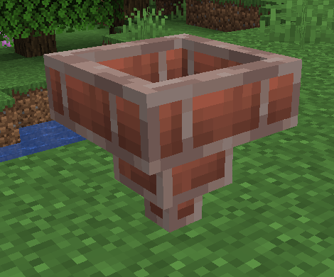

# Brick Hopper

[.svg)](https://www.curseforge.com/minecraft/mc-mods/brick-hopper)
[.svg)](https://www.curseforge.com/minecraft/mc-mods/brick-hopper/files)

This is a **Minecraft Forge** mod and adds a **Brick Hopper** to the game.

It acts like a vanilla hopper but is a bit slower than a vanilla hopper (12 ticks instead of 8, configurable) and has only three slots.

For more information check out the **Wiki**: https://github.com/cech12/BrickHopper/wiki
